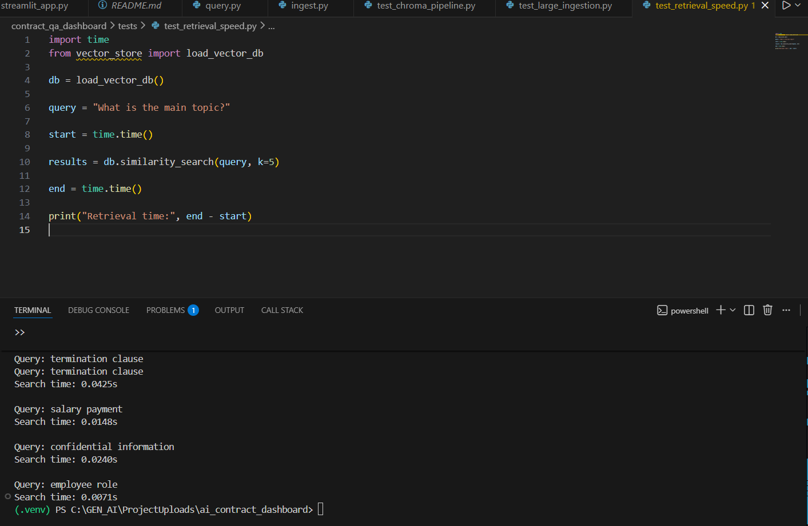

# 📄 AI Contract QA Dashboard (RAG-based Document Intelligence)

An end-to-end **Retrieval-Augmented Generation (RAG)** system for querying and analyzing legal contracts using semantic search and vector databases.

This project demonstrates a scalable pipeline for **document ingestion, embedding generation, vector storage, and semantic question answering** over contract documents.

---

## 🚀 Project Overview

The AI Contract QA Dashboard allows users to:

- Upload and ingest contract documents
- Convert documents into semantic embeddings
- Store embeddings in a persistent vector database
- Perform fast semantic search over contracts
- Retrieve relevant clauses using natural language queries

The system is designed with **production-oriented architecture**, modular components, and scalability testing.

---

## 🧠 Key Features

✅ Retrieval-Augmented Generation (RAG) pipeline  
✅ Persistent Chroma Vector Database  
✅ Semantic similarity search  
✅ Modular vector store abstraction  
✅ Batch embedding ingestion  
✅ Scalability testing with large datasets  
✅ Fast query retrieval (<50ms search time)  
✅ Clean API-ready architecture

---

## 🏗️ System Architecture

Documents → Ingestion Pipeline → Chunking → Embeddings
↓
Chroma Vector Database (Persistent Storage)
↓
Semantic Search / Query Engine
↓
Relevant Contract Clauses


## ⚙️ Tech Stack

- **Python 3.11**
- **LangChain**
- **ChromaDB**
- **SentenceTransformers**
- **FAISS-style semantic retrieval**
- **Local Embeddings (all-MiniLM-L6-v2)**

---


---

## 🔄 How the Pipeline Works

### 1️⃣ Document Ingestion

- Loads `.txt`, `.pdf`, and `.md` contracts
- Splits documents into semantic chunks
- Generates embeddings using SentenceTransformers
- Stores vectors in Chroma persistent storage

---

### 2️⃣ Vector Storage

The system uses a modular vector store design:

- `base.py` → abstract interface
- `chroma_store.py` → concrete implementation
- Easily replaceable with Pinecone, Weaviate, etc.

---

### 3️⃣ Querying

Natural language queries are converted into embeddings and matched against stored contract chunks using similarity search.

Example queries:

termination clause
salary payment
confidential information
employee responsibilities


---

## 📊 Scalability Testing

A custom benchmark was implemented to simulate large datasets.

### Test Results

| Metric | Result |
|------|------|
| Documents Generated | 160+ |
| Chunks Indexed | 480 |
| Ingestion Time | ~9 seconds |
| Query Time | 0.01 – 0.04 seconds |

This demonstrates efficient retrieval performance suitable for production-scale applications.

---

## ▶️ Installation

```bash
git clone https://github.com/NazarAbbas234/ai-contract-qa-dashboard.git
cd ai-contract-qa-dashboard

python -m venv .venv
.venv\Scripts\activate

pip install -r requirements.txt

▶️ Run Ingestion
python -m contract_qa_dashboard.ingest

▶️ Run Query Test
python -m contract_qa_dashboard.tests.test_reload

▶️ Run Scalability Benchmark
python -m contract_qa_dashboard.tests.test_large_ingestion


💡 Design Goals

This project focuses on:

Real-world RAG architecture

Maintainable backend design

Scalable document processing

Production-ready structure for GenAI systems


📈 Future Improvements

Streamlit-based chat UI

LLM answer generation layer

Metadata filtering

Hybrid search (keyword + semantic)

Cloud vector DB integration

Multi-user document workspace


👨‍💻 Author

Nazar Abbas

AI / Machine Learning Developer specializing in:

Retrieval-Augmented Generation (RAG)

Vector Databases

Local LLM Pipelines

Document Intelligence Systems


⭐ Why This Project Matters

Modern enterprise AI systems rely on RAG pipelines to safely query private data without retraining large models.

This project demonstrates the full lifecycle of such a system — from ingestion to scalable retrieval.

----------------------------------------
## 🖼️ Demo
----------------------------------------

###Example run of the system:



